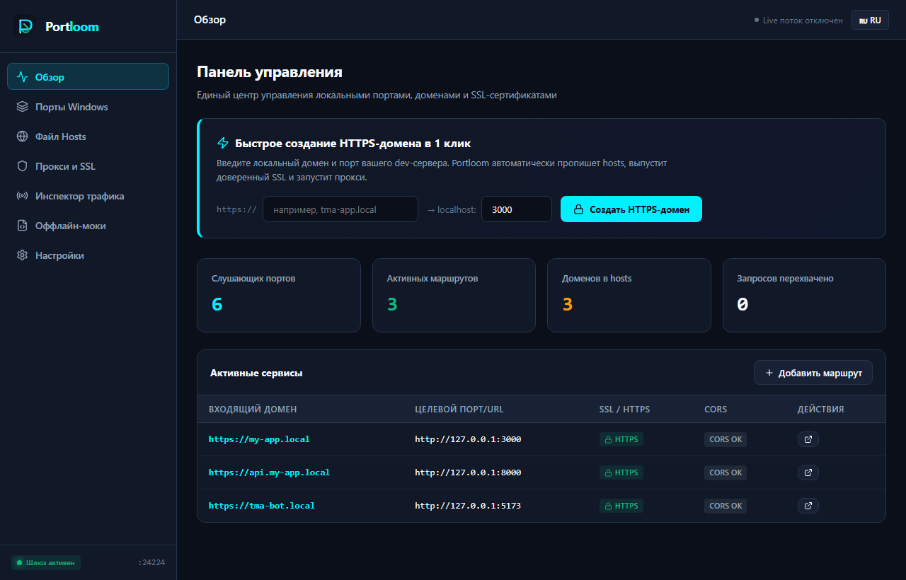

<p align="center">
  
</p>

<p align="center">
  <strong>Высокопроизводительный локальный шлюз разработчика под Windows.</strong><br>
  Объединяет управление портами, профили hosts, выпуск доверенных SSL-сертификатов и обратный прокси с инспектором вебхуков в едином автономном рабочем пространстве.
</p>

<p align="center">
  <a href="README.md"><strong>🇬🇧 Read in English</strong></a> •
  <a href="#возможности">Возможности</a> •
  <a href="#установка">Установка</a> •
  <a href="#быстрый-старт">Быстрый старт</a> •
  <a href="#архитектура">Архитектура</a> •
  <a href="ROADMAP.md">План развития</a> •
</p>

<p align="center">
  
</p>

---

## Зачем нужен Portloom?

Каждый веб- и фулстек-разработчик на Windows ежедневно сталкивается с рутиной:
1. **Конфликты портов (`EADDRINUSE`):** Сервер разработки (Vite, Next.js, FastAPI, Go) аварийно завершается, но сетевой порт 3000 или 8080 остаётся занят зомби-процессом. Приходится открывать консоль, вводить `netstat -ano | findstr :3000`, искать PID и вызывать `taskkill`.
2. **Требование локального HTTPS:** Современные браузеры блокируют Web Crypto, Service Workers, Clipboard API, WebRTC и защищенные cookies на небезопасных соединениях. Разработка Telegram Mini Apps и VK Mini Apps требует строго HTTPS. Выпуск локального сертификата и настройка доверия в Windows через OpenSSL превращается в головную боль.
3. **Хаос в файле `hosts`:** Файл `C:\Windows\System32\drivers\etc\hosts` требует прав администратора, легко ломается, не поддерживает группировку по проектам и требует ручного сброса кэша `ipconfig /flushdns`.
4. **CORS и склейка микросервисов:** Фронтенд на порту 5173 и бэкенд на 8000 требуют либо настройки заголовков CORS, либо запуска тяжелого Docker с Nginx.
5. **Отладка вебхуков без облаков:** Разработчикам ботов и платежных систем (ЮKassa, Т-Банк, Сбер, Robokassa) нужно видеть входящие запросы. Облачные туннели (ngrok) требуют зарубежной оплаты или регистрации, добавляют задержки и блокируются.

**Portloom решает все пять задач в одном быстром, открытом и локальном приложении.**

---

## Возможности

- ⚡ **Интерактивная матрица портов:** Отображение всех слушающих портов Windows в реальном времени. Поиск по порту и имени процесса, просмотр оперативной памяти, завершение процессов в 1 клик.
- 🔒 **1-Клик доверенный локальный SSL (Root CA):** Генерация и автоматическая установка локального корневого сертификата в системное хранилище Windows. Выпуск X.509 сертификатов с SAN для любых доменов (`*.local`, `localhost`).
- 🌐 **Менеджер профилей Hosts:** Безопасное управление `hosts`. Группировка записей по проектам, включение и отключение доменов чекбоксами, автоматический бэкап перед каждой записью и мгновенный сброс DNS-кэша.
- 🔀 **Динамический обратный прокси:** Маршрутизация доменов и путей (`https://app.local` → `:5173`, `https://app.local/api` → `:8000`) с автоматическим TLS и прозрачной поддержкой WebSocket / HMR.
- 📡 **Инспектор вебхуков и трафика:** Перехват входящих HTTP-запросов в реальном времени. Просмотр заголовков, форматированный JSON, копирование команды cURL и оффлайн-мокирование ответов.
- 🛡️ **0% телеметрии и 100% оффлайн:** Полная автономность. Никаких аккаунтов, никаких токенов, никакой аналитики, нулевая зависимость от внешних CDN.
- 🇷🇺 **Полная поддержка кириллицы:** Проверенная работа с русскоязычными именами пользователей Windows (`C:\Users\Иван\...`) и путями с пробелами.

---

## Установка

### Вариант 1: Запуск через NPX (Без установки)
```bash
npx portloom
```

### Вариант 2: Глобальная установка через NPM
```bash
npm install -g portloom
portloom
```

### Вариант 3: Портативная версия для Windows
Скачайте готовый архив `portloom-v1.0.0-win-x64.zip` из раздела [Releases](https://github.com/portloom/portloom/releases), распакуйте в любую папку и запустите `portloom.cmd`.

---

## Быстрый старт

1. Запустите Portloom:
   ```bash
   portloom
   ```
2. Откройте интерфейс в браузере: `http://localhost:24224`.
3. **Создайте первый HTTPS-домен:**
   - Перейдите во вкладку **Прокси и SSL**.
   - Нажмите **Добавить маршрут**:
     - Домен: `my-app.local`
     - Порт dev-сервера: `3000` (или порт вашего приложения)
     - Оставьте включенными галочки **Выпустить SSL** и **Добавить в hosts**.
   - Нажмите **Сохранить**.
4. Откройте `https://my-app.local` в браузере. Замочек горит зеленым, а запросы отображаются в реальном времени во вкладке **Инспектор трафика**.

---

## Использование из командной строки (CLI)

```bash
# Показать список активных портов и процессов
portloom list

# Освободить порт (убить процесс)
portloom kill 3000

# Запустить шлюз в фоне
portloom start --port 24224

# Сбросить DNS-кэш Windows
portloom flushdns
```

---

## Архитектура

```
Браузер / Клиент (https://app.local)
       │
       ▼
[Windows DNS / hosts (127.0.0.1)]
       │
       ▼
[Шлюз Portloom (Порт 443 / 8443)]
       │  ├─ Динамический диспетчер SNI (сертификаты локального CA)
       │  ├─ Инспектор трафика и движок оффлайн-моков
       │  └─ Потоковый обратный прокси
       ▼
Ваши локальные сервисы (Vite :5173, FastAPI :8000 и др.)
```

---

## Конфиденциальность и безопасность

- **Никакой телеметрии:** Portloom не собирает и не отправляет во внешнюю сеть идентификаторы устройств, пути к файлам или данные запросов.
- **Привязка к Localhost:** Управляющий API слушает исключительно адрес `127.0.0.1`.
- **Защита системы:** Системные процессы Windows защищены внутренним списком исключений.
- Подробнее в документах [SECURITY_MODEL.md](docs/SECURITY_MODEL.md) и [PRIVACY.md](PRIVACY.md).

---

## Лицензия

Проект распространяется под свободной лицензией [MIT](LICENSE).
